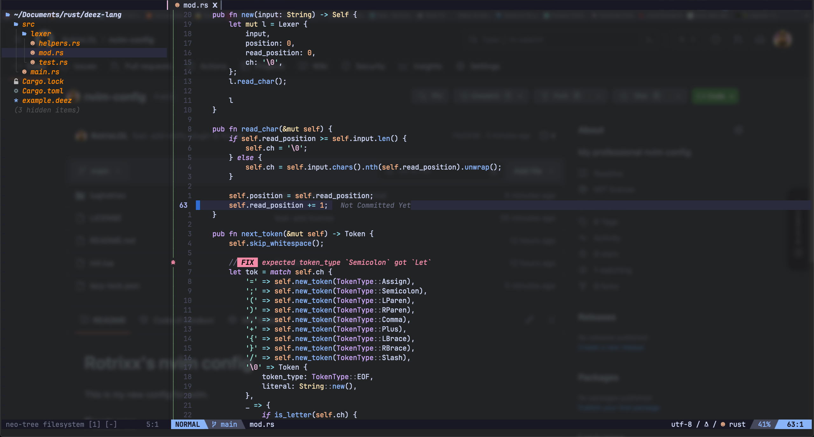
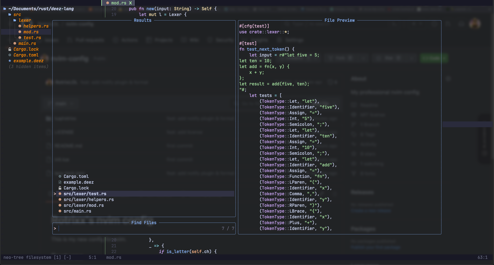
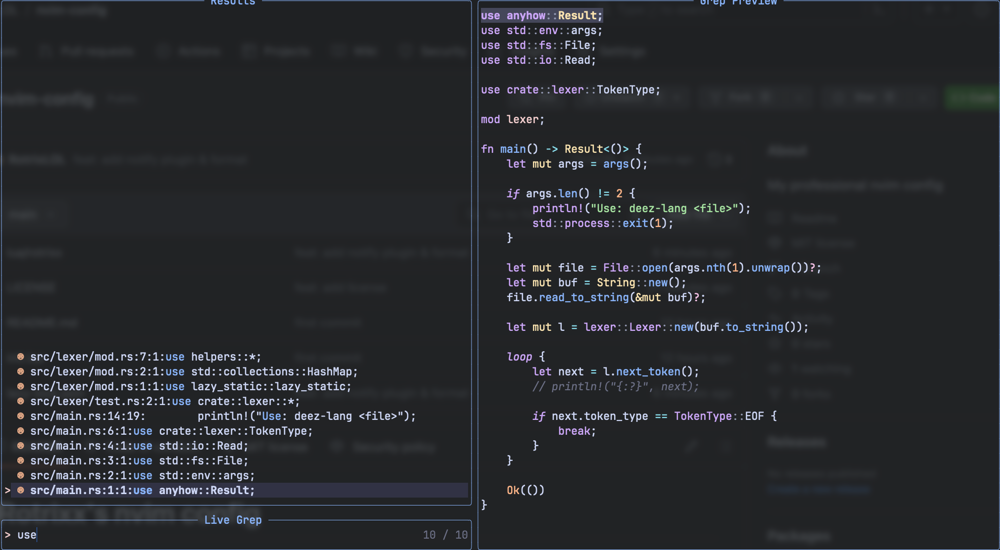

# Rotrixx's nvim config

This is my new config for nvim.

## Features

* Lazy package manager
* Telescope
* LSP
* Treesitter
* Barbar as buffer line
* Catppuccin theme
* Lualine
* Gitsigns
* Auto-save
* Codeium for AI code completion
* Neo-tree
* Comment.nvim for commenting lines and visual mode lines
* and many more!

## Preview

